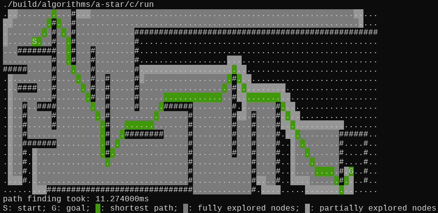

### A-Star Path Finding

#### C

An A-Star impl that utilises and open list and a closed set.
Since the open list needs to be sorted every iteration and algorithm needs to check if a node is in the list, it could be explored if an ordered set (potentially a RB-tree) provides substential improvements.

